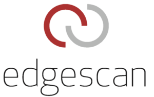
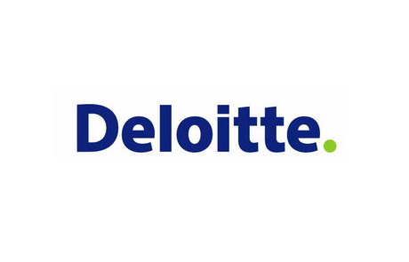
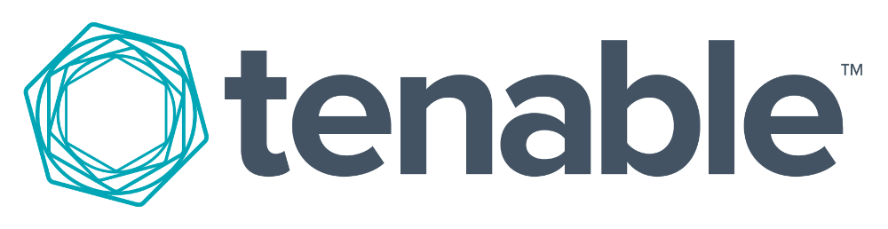

---

layout: col-sidebar
title: OWASP Dublin
tags: dublin
level: 0
region: Europe

meetup-group: OWASP-Dublin
country: Ireland
postal-code: 

---

OWASP Dublin
-------------
Welcome to the Dublin chapter homepage. The chapter board is <a href="mailto:Antonio.stano@owasp.org">Antonio Stano</a> and <a href="mailto:vaibhav.gupta@owasp.org">Vaibhav Gupta</a>.
  

Next Meeting/Event(s)
---------------------
OWASP Dublin Chapter meetings are posted on our MeetUp Page:

Please visit <a href="http://www.meetup.com/OWASP-Dublin">http://www.meetup.com/OWASP-Dublin</a> for all chapter event information.

Please follow OWASP Dublin Chapter on <a href="https://twitter.com/OWASPIreland">Twitter</a>/<a href="https://facebook.com/OWASPIreland">Facebook</a>/<a href="https://meetup.com/OWASP-Dublin">MeetUp</a>

Past meetups: [https://www.meetup.com/owasp-dublin/events/?type=past](https://www.meetup.com/owasp-dublin/events/?type=past)
  

Chapter Sponsors
----------------
The following are the list of OWASP Corporate Members who have generously aligned themselves with the Dublin chapter, therefore contributing funds to our chapter:

<table cellpadding="10" cellspacing="0" border="0">
<tr>
    <td align="center" width="25%">
    
      <b>EdgeScan</b>
    </td>
</tr>
</table>
  

Meeting Sponsors
----------------

The following is the list of organisations who have generously provided us with space for OWASP Dublin chapter meetings:

<table cellpadding="10" cellspacing="0" border="0">
<tr>
    <td align="center" width="25%">
    
      <b>Morgan McKinley</b>
    </td>
    <td align="center" width="25%">
    
      <b>Amazon</b>
    </td>
    <td align="center" width="25%">
    
      <b>Workday</b>
    </td>
    <td align="center" width="25%">
    
      <b>Deloitte</b>
    </td>
</tr>
<tr>
    <td align="center" width="25%">
    
      <b>KPMG</b>
    </td>
    <td align="center" width="25%">
    
      <b>Hays</b>
    </td>
    <td align="center" width="25%">
    
      <b>Tenable</b>
    </td>
    <td align="center" width="25%">
    </td>
</tr>
</table>
  

Speaking at OWASP Dublin Chapter Events
---------------------------------------

#### Call For Speakers

Call For Speakers is open - if you would like to present a talk on Application Security at future OWASP Dublin Chapter events - please review and agree with the [OWASP Speaker Agreement](https://owasp.org/www-policy/legal/speaker-agreement) and send the proposed talk title, abstract and speaker bio to the Chapter Leaders via e-mail or via [CFP Google Form](https://forms.gle/PCyXCEPLFhXJy8WV8)

Organisation Team
---------------------------------------
<a href="mailto:Antonio.stano@owasp.org">Antonio Stano</a>  
<a href="mailto:vaibhav.gupta@owasp.org">Vaibhav Gupta</a>  
<a href="mailto:denise.murtaghdunne@owasp.org">Denise Murtagh-Dunne</a>  

    